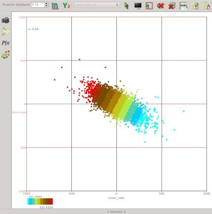

{}
This attribute plugin for the open source seismic interpretation platform [OpendTect] calculates 6 attributes based on different
parameterizations of reflection intercept and gradient.

## Description

The intercept-gradient crossplot is widely used for amplitude-variation-with-offset (AVO) analysis in hydrocarbon exploration.
The intercept is the zero offset or normal incidence reflection amplitude/coefficient of an event while the gradient is the change
in reflection amplitude/coefficient with offset or incidence angle. Some authors refer to intercept as A or P and gradient as B or
G. Modelling studies show that changes in subsurface rock properties such as lithology, porosity and pore fluid content result in
systematic changes in intercept-gradient space. The following figure, adapted from the very informative paper on AVO by
[Foster etal (2010)](http://library.seg.org/doi/abs/10.1190/1.3467825 "Interpretation of AVO anomalies. Douglas J. Foster, Robert G. Keys, and F. David Lane. GEOPHYSICS 2010 75:5, 75A3-75A13"),
illustrates the ideal intercept-gradient crossplot response for a clastic sequence to changes in porosity and pore fluid.
The Fluid Line or Background Trend is where reflections from shales and some wet sands that have little contrast in Vp/Vs plot.



Another popular classification of AVO effects on the intercept-gradient crossplot is the 3 class AVO scheme of [Rutherford and Williams (1989)](http://library.seg.org/doi/abs/10.1190/1.1442696 "Amplitude‐versus‐offset variations in gas sands. Steven R. Rutherford and Robert H. Williams GEOPHYSICS 1989 54:6, 680-688") based on acoustic impedance contrasts with the addition of a 4th class for high porosity gas sands introduced by [Castagna and Swan (1997)](http://library.seg.org/doi/abs/10.1190/1.1437626 "Principles of AVO crossplotting. John P. Castagna and Herbert W. Swan. The Leading Edge 1997 16:4, 337-344"). The position of these 4 AVO classes on the intercept-gradient crossplot is shown in the following figure.



This plugin calculates 6 attributes which are essentially just coordinate transformations of the intercept and gradient that aim to highlight changes of a particular rock property based on the expected behaviour of clastic reservoir sequences.


| ATTRIBUTE                    | DESCRIPTION |
|----------------------------|-------------|
|  | <h4 class="text-center">Fluid Factor</h4> Fluid Factor is a reprojection of intercept/gradient coordinates that highlights deviation from the Fluid Line. As the name implies this attribute highlights changes related to fluid compressibility. The Fluid Factor was introduced by <a href="http://gp.eage.org/publication/publicationdetails/?publication=32676" title="Weighted stacking for rock property estimation and detection of gas. G. C. Smith and P. M. Gidlow. Geophysical Prospecting 1987, Vol. 35, No. 9, pp. 993 - 1014">Smith and Gidlow (1987)</a>. |
|  | <h4 class="text-center">Lithology Factor</h4> Lithology Factor is the companion coordinate reprojection to Fluid Factor. It highlights changes parallel to the Fluid Line. |
|  | <h4 class="text-center">Porosity Factor</h4> Porosity Factor is just Lithology Factor with the values above the fluid line reversed so the attribute magnitude always increases in the same sense as the effect of increasing porosity, i.e. the attribute magnitude increases to the upper left below the Fluid Line and to the lower right above the Fluid Line. |
|  | <h4 class="text-center">Crossplot Angle</h4> Crossplot Angle is the angle between an intercept-gradient point and the Fluid Line. It runs from 0 to 180 below the Fluid Line measured counter-clockwise from the upper left projection of the Fluid Line. It runs from 0 to -180 above the Fluid Line measured counter-clockwise from the lower right projection of the Fluid Line. The Crossplot Angle and Deviation can be interpreted as the polar coordinates of a data point in the intercept-gradient crossplot space. |
|  | <h4 class="text-center">Crossplot Deviation</h4>  Crossplot Deviation is the distance from the crossplot origin. This attribute is most useful as a transparency mask to remove data close to the centre of the crossplot. |
|  | <h4 class="text-center">AVO Class</h4>  AVO Class classifies intercept-gradient points according to the 4 class AVO scheme of Rutherford and Williams (1989) and Castagna and Swan (1997). Points below the Fluid Line have a positive class number and those above have a negative class number. |


## Input Parameters

These attributes have 4 required parameters and 4 extra parameters that may be required depending on the attribute being calculated:


| NAME                    | DESCRIPTION |
|-------------------------|-------------|
| Intercept Volume | The attribute volume to use as the zero offset or normal incidence reflection amplitude coefficient. If no intercept volume is available a near angle or offset stack can be used as an alternative. |
| Gradient Volume  | The attribute volume to use as the change in reflection amplitude/coefficient with offset at normal incidence. If no gradient volume is available, the difference between amplitudes on far and near angle or offset stacks can be used as an alternative. |
| Output           | The attribute to calculate. There is a choice of Fluid Factor, Lithology Factor, Porosity Factor, Crossplot Angle, Crossplot Deviation or AVO Class. |
| Crossplot Slope  | The slope of the fluid line interpreted on the intercept-gradient crossplot. This can be read from the properties dialog of the crossplot tool. |
| Intercept Standard Deviation (Optional) | Standard deviation of the intercept volume. Only required for the Crossplot Angle and Crossplot Deviation attributes. This can be read from the 1D histogram tool in the crossplot table. |
| Gradient Standard Deviation (Optional)  | Standard deviation of the gradient volume. Only required for the Crossplot Angle and Crossplot Deviation attributes. This can be read from the 1D histogram tool in the crossplot table. |
| Correlation Coefficient (Optional)      | Correlation coefficient between the intercept and gradient volumes. Only required for the Crossplot Deviation attribute. This can be read from the properties dialog of the crossplot tool. |,
| Class 2 Intercept Offset | Half width in intercept coordinates of the Class 2 region on the AVO Class crossplot. Only required for the AVO Class attribute.']]




