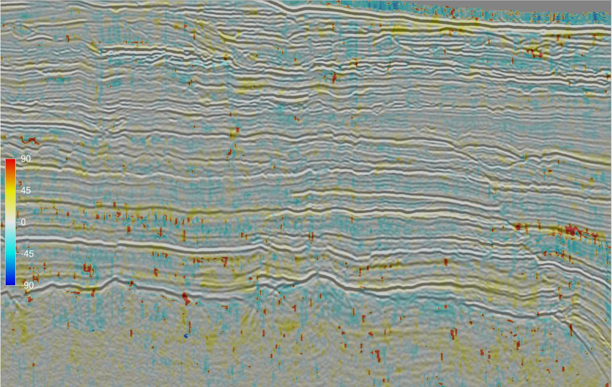

{}

This attribute plugin for the open source seismic interpretation platform [OpendTect] calculates 6 attributes derived from AVO Polarization
in the AVO Intercept-Gradient crossplot as described by
[Mahob and Castagna (2003)](https://library.seg.org/doi/10.1190/1.1581037 "AVO polarization and hodograms: AVO strength and polarization product. Patrice Nsoga Mahob and John P. Castagna, GEOPHYSICS, VOL. 68, NO. 3, MAY-JUNE 2003").

## Description

The intercept-gradient crossplot is widely used for amplitude-variation-with-offset (AVO) analysis in hydrocarbon exploration.
The intercept is the zero offset or normal incidence reflection amplitude/coefficient of an event while the gradient is the
change in reflection amplitude/coefficient with offset or incidence angle. Some authors refer to intercept as A or P and gradient
as B or G. Traditional methods of AVO interpretation focus on individual sample points in isolation essentially treating them as
reflection coefficients. [Keho etal (2001)](https://library.seg.org/doi/abs/10.1190/1.1487253 "The AVO hodogram: Using polarization to identify anomalies. Tim Keho, Skip Lemanski, Robert Ripple, and Bahal Raja Tambunan The Leading Edge 2001 20:11, 1214-1224") observed that this approach ignores the seismic wavelet. Convolving a seismic reflection coefficient with a typical seismic wavelet produces a series of points spread across all 4 quadrants of the AVO crossplot. Further distortions are introduced by residual time shifts across offsets and NMO stretch. [Keho etal (2001)](https://library.seg.org/doi/abs/10.1190/1.1487253 "The AVO hodogram: Using polarization to identify anomalies. Tim Keho, Skip Lemanski, Robert Ripple, and Bahal Raja Tambunan The Leading Edge 2001 20:11, 1214-1224") proposed analysing the AVO crossplot for small time windows of 0.5-1 times the wavelet wavelength as hodograms using the polarization angle as a key measure. [Mahob and Castagna (2003)](https://library.seg.org/doi/10.1190/1.1581037 "AVO polarization and hodograms: AVO strength and polarization product. Patrice Nsoga Mahob and John P. Castagna, GEOPHYSICS, VOL. 68, NO. 3, MAY-JUNE 2003")
subsequently extended the analysis with a number of other measures to describe the hodogram.



This plugin calculates the 6 attributes (Background Polarization Angle, Event Polarization Angle, Polarization Angle Difference, Strength, Polarization Product and Quality) defined by [Mahob and Castagna (2003)](https://library.seg.org/doi/10.1190/1.1581037 "AVO polarization and hodograms: AVO strength and polarization product. Patrice Nsoga Mahob and John P. Castagna, GEOPHYSICS, VOL. 68, NO. 3, MAY-JUNE 2003"). The parameters are estimated by eigendecomposition of the covariance matrix for the intercept-gradient crossplot.


| EXAMPLE | ATTRIBUTE |
|---------|-----------|
|  | <h4 class="text-center">Background Polarization Angle</h4> Polarization Angle for all AVO crossplot points over a user specified time/depth window and volume of traces. The polarization angle is the orientation of the largest eigenvector relative to the positive intercept axis and varies from -90 to 90 degrees. |
|  | <h4 class="text-center">Event Polarization Angle</h4> Polarization Angle for AVO crossplot points in the user specified event time/depth window. Recommend using 0.5-1 times the wavelength. The polarization angle is the orientation of the largest eigenvector relative to the positive intercept axis and varies from -90 to 90 degrees. |
|  | <h4 class="text-center">Polarization Angle Difference</h4> The difference between the event and background polarization angles. |
|  | <h4 class="text-center">Strength</h4>The Mahob and Castagna measure of the distance of the hodogram points from the origin within the event time/depth window. |
|  | <h4 class="text-center">Polarization Product</h4> The product of the Strength and Polarization Angle Difference attributes. |
|  | <h4 class="text-center">Quality</h4> This is the ratio of the eigenvalue difference to the eigenvalue sum. It is a measure of the linearity of the points in the intercept-gradient crossplot. It ranges from 0 to 1 with higher values indicating the analysis points have a more linear hodogram and more reliable results. |


## Input Parameters

These attributes have 3 required parameters and 3 extra parameters that may be required depending on the attribute being calculated:


| NAME | DESCRIPTION |
|------|-------------|
| Intercept | The attribute volume to use as the zero offset or normal incidence reflection amplitude coefficient. If no intercept volume is available a near angle or offset stack can be used as an alternative. |
| Gradient  | The attribute volume to use as the change in reflection amplitude/coefficient with offset at normal incidence. If no gradient volume is available, the difference between amplitudes on far and near angle or offset stacks can be used as an alternative. |
| Output    | The attribute to calculate. There is a choice of Background Polarization Angle, Event Polarization Angle, Polarization Angle Difference, Strength, Polarization Product or Quality. |
| Background time/depth gate (Optional) | The time/depth gate used to estimate the Background Polarization Angle. Only required for the Background Polarization Angle, Polarization Angle Difference and Polarization Product attributes. |
| Stepout (Optional) | The extent of the trace volume used to estimate the Background Polarization Angle. Only required for the Background Polarization Angle, Polarization Angle Difference and Polarization Product attributes. |
| Event time/depth gate (Optional) | The time/depth gate used to estimate the Event Polarization Angle. Required for the Event Polarization, Polarization Angle Difference, Polarization Product and  Quality attributes. |




