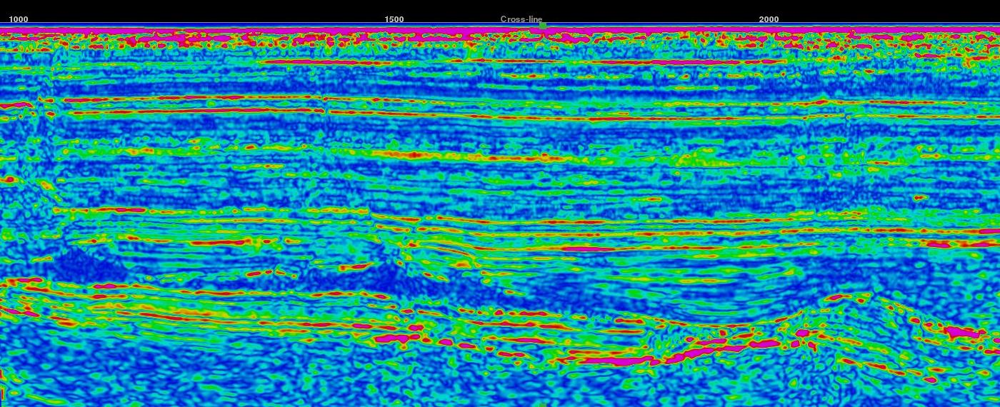

{}
This attribute plugin for the open source seismic interpretation platform [OpendTect] Version 6.0.0 or later performs spectral
(time-frequency) decomposition using a recursive filter.

## Description

This plugin can be used as an alternative to the
<a href="http://opendtect.org/rel/doc/User/base/appendix_spectral-decomposition.htm" target="_blank">OpendTect FFT spectral decomposition attribute</a>.

It does spectral decomposition using [Nilsen's (2007)](https://bora.uib.no/bitstream/handle/1956/3036/42162315.pdf?sequence=1 "Recursive time-frequency reassignment. Geir Kjetil Nilsen. University of Bergen, Norway MSc Thesis") time-frequency analysis algorithm which is a recursive filter approximation to a special case of the short time fourier transform (STFT).

The primary advantage of this plugin over the standard OpendTect FFT spectral decomposition is that it can be evaluated significantly faster.
As an example, under Linux on an Intel Core i5 for a 2000 sample per trace dataset, this attribute can generate a single frequency cube
at 4000 traces per second. This is considerably faster than the 140-150 traces per second achieved when applying the OpendTect FFT
spectral decomposition attribute. This processing speed advantage is reduced as the number of output frequencies increases but in this
test case it still remains substantially faster even for output of up to 30 frequencies. This algorithm is also more accurate for
shorter windows.

As of release 6.4.8 the plugin has been extended to optionally include time-frequency reassignment. In normal spectral decomposition a
window/gate is slid along the trace and the amplitude of each frequency component is assigned to the middle of the gate. This blurs/smooths
the decomposition along both the time and frequency axis. While shortening the gate can improve the apparent time resolution, it has the
side effect of increased blurring/smoothing, i.e. lower resolution, in frequency. Reassignment uses information in the phase spectrum to
relocate spectral energy to its origin in the time gate and on the frequency axis. This produces significantly sharper time-frequency spectra.
However reassignment becomes ambiguous when more than one signal component is present and they are close or overlap in time or frequency.
To perform the reassignment the decomposition must be done for a range of frequencies so execution time will be slower than without reassignment.

## Examples

    
    

 
The output of the RSpec attribute (rfreq30) is visually identical and also highly correlated to the OpendTect FFT spectral decomposition
(sdfreq30) as shown in the following crossplot of the two attributes.



Here is an inline display from the F3 demo dataset comparing the 24Hz component for a +/-16ms gate for all 4 methods. The enhanced time
resolution of the reassigned decomposition is obvious.



Here is the 24Hz component on the MSF4 horizon for all 4 methods. Channels are better defined on the Recursive and Local Attribute
decompositions relative to the OpendTect spectral decomposition attribute. The reassigned decomposition has a radically different
appearance due to its sharpness in time and frequency but the significance of the variations is unknown.



## Input Parameters

This attribute has 4 parameters:

| NAME | DESCRIPTION |
|------|-------------|
| Input Volume | The attribute volume to be analysed. |
| Time/Depth Gate | This determines the position and time resolution of the analysis. The value from the gate centre is output - useful for analysing a zone offset from an horizon. Recommend setting the gate length equal to or less than the FFT window length you would used for the standard OpendTect FFT spectral decomposition. |
| Output frequency | When displaying the attribute in the tree this is the frequency slice that will be generated. |
| Step | This determines the set of frequencies that can be chosen when generating a frequency volume. |
| With Reassignment | Toggle on to compute the reassigned decomposition |




